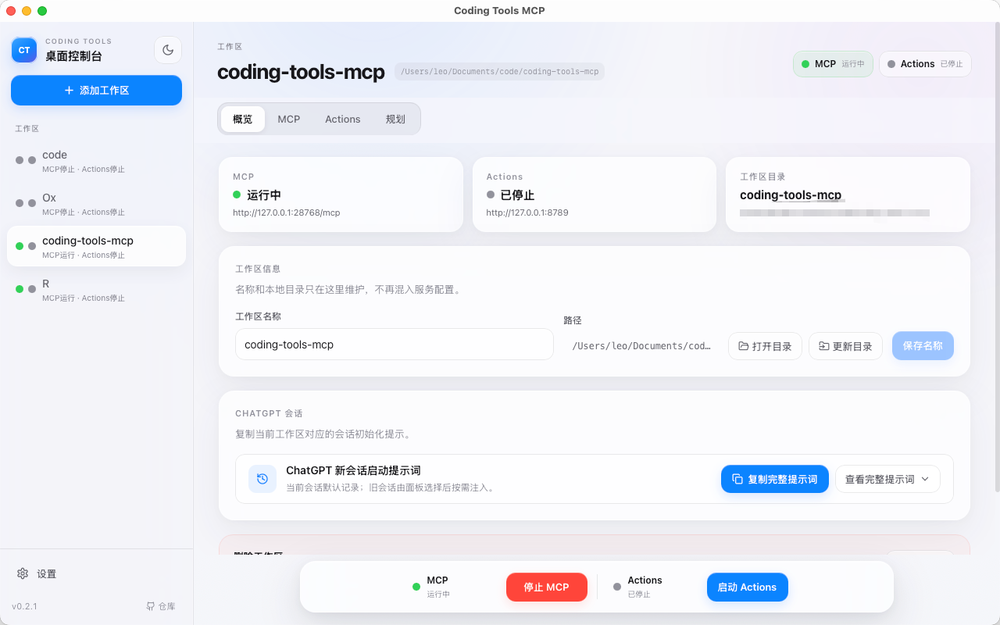
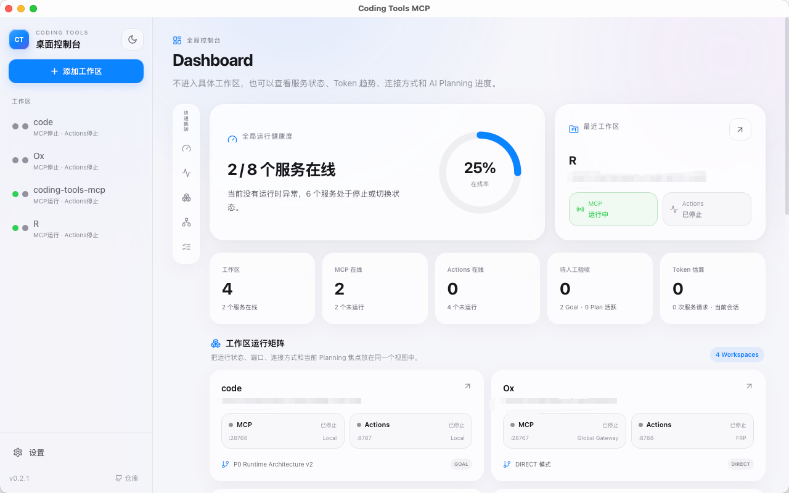
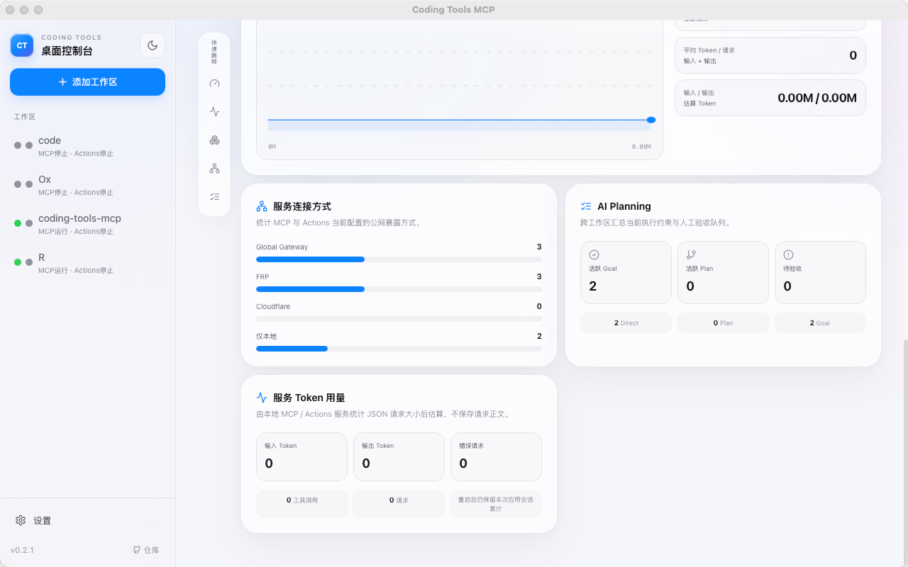
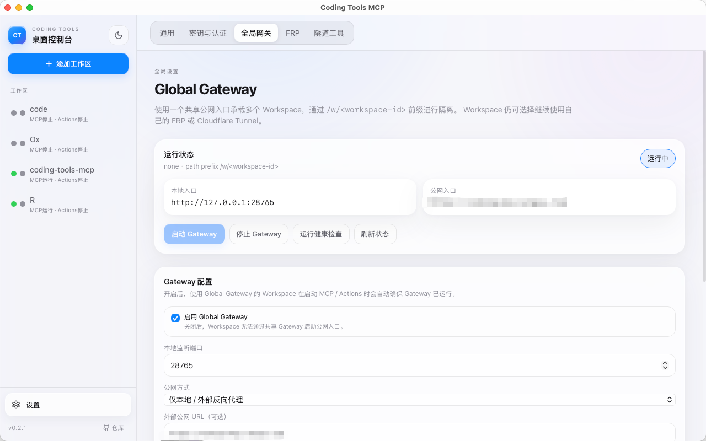
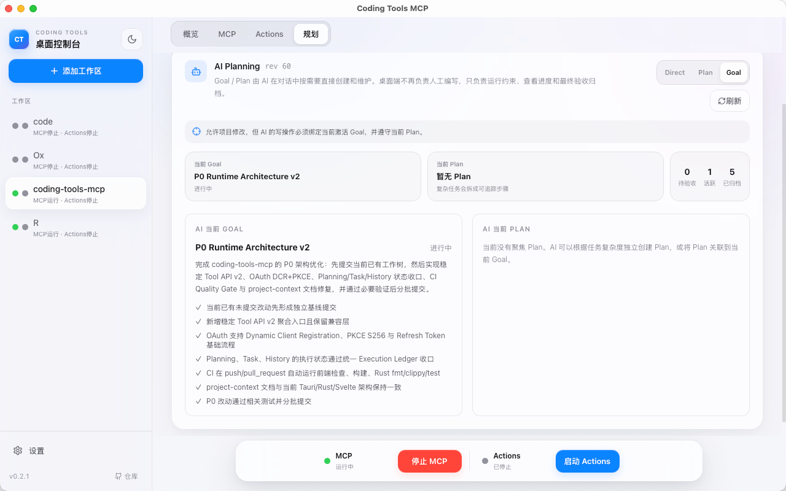
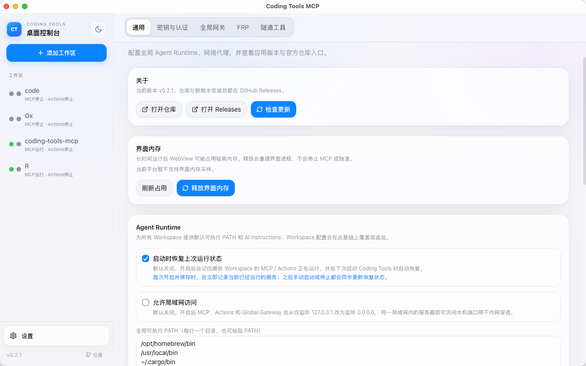

<p align="center">
  
</p>

<h1 align="center">Coding Tools MCP</h1>

<p align="center">
  Turn a local project into a persistent AI development workspace that carries context across conversations.
</p>

<p align="center">
  <a href="https://github.com/lengsukq/coding-tools-mcp/releases/latest"></a>
  
  
  <a href="https://www.apache.org/licenses/LICENSE-2.0"></a>
</p>

<p align="center">
  <a href="README.md">中文</a> · <a href="README.en.md">English</a> · <a href="https://github.com/lengsukq/coding-tools-mcp/releases/latest">Download latest</a>
</p>

Coding Tools MCP is a Rust + Tauri 2 desktop application. Select a project directory and start the service; an AI agent can then read files, edit code, run commands and tests, inspect Git, and preserve development progress inside the project through MCP. It behaves like an AI opening an IDE workspace that remembers where the last conversation stopped.



*Current workspace overview: `coding-tools-mcp` is the active workspace, with MCP / Actions status, the project directory, and the session-recovery entry point visible.*

## Feature overview: characteristics and advantages

Coding Tools MCP is more than an MCP URL forwarder. It is a **Workspace-first** AI development runtime: the desktop app manages projects and services, one tool runtime performs controlled operations, and MCP or GPT Actions provides the client-facing entry point.

| Feature | Main characteristics | Practical advantages |
| --- | --- | --- |
| Workspace management | Each project has its own directory, name, ports, auth, and tunnel configuration | Clearer multi-project switching and less risk of sending a command or credential to the wrong project |
| MCP tool runtime | Files, patches, commands, Git, images, Skills, and state management share one core | MCP and Actions behave consistently; policy, errors, and permissions do not drift by entry point |
| GPT Actions | Exposes an OpenAPI Schema, privacy-policy URL, and authentication settings | Custom GPTs can use the same development capabilities when MCP Connector is unavailable |
| Connectivity and public entry points | Local endpoints, Global Gateway, FRP, and Cloudflare Tunnel | The same workspace can serve local development and remote ChatGPT access |
| Authentication | OAuth Authorization Code, PKCE S256, DCR, and Refresh Tokens, with Bearer and static-client compatibility | Modern OAuth flows are available without abandoning older clients or simple deployments |
| Planning / Goal / Task | Direct, Plan, and Goal modes with one Execution Ledger | Complex work can be decomposed, resumed, verified, and handed off with less drift |
| Conversation history | Lossless Markdown archives plus bounded state, search, pagination, and startup prompts | Context follows the repository instead of one chat window, without injecting every old message |
| Logs and health checks | Inspect requests, endpoints, OAuth metadata, and connectivity results in the desktop app | Faster diagnosis of whether a problem is local service, tunnel, authentication, or client-side |
| Workspace-first security | Read-only by default outside the workspace, protected Git assets, patch preflight, explicit dangerous-operation confirmation | Clear and controllable permissions make it suitable for real projects, not just demos |

### Global Dashboard: see the whole system without opening a workspace

The global Dashboard summarizes multiple workspaces in one control surface. It does not require opening a project first; it shows service availability, the recent workspace, MCP / Actions status, the workspace runtime matrix, and the current Planning focus.



*Health, the recent workspace, and each service's connection mode are visible together, making it easy to judge the overall runtime state.*

The Dashboard also refreshes estimated token usage for the current application session and breaks it down by connection mode, AI Planning queue, and service token details. Token usage is estimated from local request sizes; request bodies are not stored.



*Workspace count, online services, pending acceptance, and token trends help developers understand system state and likely runtime cost before starting work.*

### 1. Workspace management: turn a project into durable, identifiable context

A workspace is the basic unit of Coding Tools MCP. It binds a local project directory and owns its service state, ports, authentication, public entry point, and conversation history. The desktop app can store multiple projects while always showing the active workspace name and path.

**Characteristics**

- The project directory is the source of truth; the workspace name is maintained separately from service configuration.
- MCP, Actions, planning state, and conversation history are organized around the active workspace.
- The sidebar switches projects quickly, while the overview page exposes service status at a glance.

**Advantages**

- Fewer mix-ups between directories, ports, and public URLs when working on multiple projects.
- Every connection gives the AI an explicit project boundary, reducing the risk of running commands in the wrong repository.
- Configuration remains available after restarting the desktop app.

### 2. MCP tool runtime: one core for real development actions

The Rust tool runtime provides file reading, search, patches, command execution, Git, images, Skills, and state management. MCP Streamable HTTP and GPT Actions do not maintain separate tool implementations; both enter the same dispatch path.

**Characteristics**

- Stable Tool API v2 uses aggregate entry points such as `history_manage`, `planning_manage`, and `task_manage`, while compatibility profiles remain available.
- Files, commands, and patches pass through one set of path boundaries, command policies, confirmations, and error structures.
- Patch operations support preflight checks and failure recovery to reduce partial writes.

**Advantages**

- Different clients receive the same tool behavior, lowering maintenance and compatibility risk.
- The AI can complete the full loop from understanding code to editing files, running tests, and checking Git.
- Permission decisions and failures are easier to explain, audit, and recover from.

### 3. GPT Actions: keep a second path for custom GPTs

In addition to MCP Connector, the desktop app can run a GPT Actions OpenAPI gateway. The Actions page exposes the OpenAPI Schema, privacy-policy URL, and authentication details for configuration through “Import from URL” in the GPT editor.

**Characteristics**

- MCP and Actions can run together for one workspace, with separate ports and public domains when needed.
- Both entry points share the same tool runtime, workspace policy, and planning/history state.
- None, API Key (Bearer), and OAuth can be selected to match the client’s capabilities.

**Advantages**

- Custom GPTs remain viable when a client does not support MCP Connector.
- Switching entry points does not change the project permissions or execution boundaries.
- OpenAPI, auth fields, and privacy-policy details are presented in one place and are easier to reproduce.

### 4. Connectivity and public entry points: move from local debugging to remote development

Every service keeps a local endpoint for development and health checks. When a remote AI client needs access, use a dedicated tunnel or route multiple workspaces through Global Gateway under `/w/<workspace-id>`.

**Characteristics**

- FRP and Cloudflare Tunnel are supported, with tunnel processes supervised by the desktop app.
- Global Gateway can reuse one public entry point and route to different projects by workspace ID.
- Stopping a service also disconnects its associated tunnel, reducing orphaned public processes.

**Advantages**

- Local development, LAN debugging, and remote ChatGPT access share the same workspace model.
- Multiple projects do not each need a separately maintained public-infrastructure stack.
- Endpoints, tunnels, and service states are visible together, making network debugging more direct.



*Global Gateway provides a shared entry point for multiple workspaces through `/w/<workspace-id>`, while FRP and Cloudflare remain available for independent tunnels.*

### 5. OAuth and authentication: modern security with client compatibility

MCP and Actions share one OAuth runtime with Authorization Code, PKCE S256, Dynamic Client Registration, and Refresh Tokens. Bearer auth and static Client ID / Secret remain available for older clients and simpler environments.

**Characteristics**

- Dynamic-registration clients can register themselves from the server metadata.
- PKCE S256 reduces the value of an intercepted authorization code.
- Access and Refresh Tokens are distinguished and bound to registered redirect URIs.

**Advantages**

- Modern clients can use a fuller OAuth flow with less manual credential copying.
- Older clients have a clear compatibility path instead of requiring a one-time migration.
- Auth settings and health checks live in the desktop app, making authorization failures easier to locate.

### 6. Planning, Goals, and Tasks: keep complex work controlled and resumable

The planning page separates goals, plans, and execution tasks. Direct suits small changes, Plan suits work that needs steps, and Goal suits long-running work with explicit acceptance criteria. The AI can create and maintain plans in conversation while the desktop app displays constraints, progress, and final acceptance records.



*The planning page shows the active execution mode, Goal / Plan state, pending acceptance count, and the Goal acceptance checklist together.*

**Characteristics**

- A Goal expresses the result and constraints, a Plan expresses the steps, and a Harness Task expresses a recoverable execution process.
- Write operations can be required to bind to the active Goal and follow the active Plan.
- The Execution Ledger projects the current step, last tool, errors, changed files, history checkpoint, and verification result in one place.

**Advantages**

- Large tasks do not depend only on chat context; work can resume from explicit state after a pause.
- Planning, execution, and acceptance stay separate, adding control to high-risk changes without removing flexibility.
- Developers can quickly see what is done, what remains, and whether the result has been verified.

### 7. Conversation history: let context follow the repository

Long-term project records live in `docs/history-session/`. Markdown archives preserve the full record, while `memory/state.json` and `memory/manifest.json` provide bounded current state and indexes. A new conversation can recover the needed context through startup prompts, search, and paginated reads.

**Characteristics**

- Supports initialization, checkpoints, validation, search, and lossless paginated reads.
- The current conversation can be recorded by default; older conversations are selected explicitly in the workspace panel.
- Only bounded snapshots and selected excerpts are injected instead of the entire history.

**Advantages**

- Project history can be backed up, reviewed, and committed without being locked to one chat platform.
- A new agent gets the current state quickly and reads older decisions only when needed, saving context and time.
- Important changes, tests, risks, and next steps become a traceable handoff record.

### 8. Logs, health checks, and security boundaries: make failures visible and permissions explicit

The desktop app exposes service logs, endpoint checks, OAuth metadata checks, and runtime status. The unified tool runtime applies workspace paths, command policies, repository protection, and dangerous-operation confirmations through one Policy layer.

Global settings also bring together the application version and Releases links, UI-memory release, the global Agent Runtime, startup restoration of running services, and LAN-access controls. Network-exposure options are off by default and explain their impact when enabled.



*General settings combine update links, WebView memory management, runtime-state restoration, LAN access, and the global executable PATH.*

**Characteristics**

- Reads, writes, and execution are allowed inside the workspace according to policy; outside the workspace is read-only by default.
- `.git`, `.github`, and other repository assets receive extra protection; dangerous operations require explicit confirmation.
- Health checks report local service, public entry point, and authentication metadata separately.
- Windows currently uses a `policy_only` execution boundary; the project does not present static policy as a full OS sandbox.

**Advantages**

- AI capabilities can approach a real development workflow while keeping the least-privilege scope explicit.
- Connection, authorization, and tool-call failures have clear diagnostic entry points.
- Security boundaries are stated honestly, making it easier to add system-level isolation where deployment requires it.

## Understand the workflow in 30 seconds

```text
Install the desktop app
  → add a project directory
  → start MCP and a public tunnel
  → copy the Public MCP URL
  → enable ChatGPT developer mode
  → create an MCP plugin and paste the URL
  → authorize it and start developing in a new conversation
```

For a first connection, remember only this: **the desktop app turns the project into an MCP workspace, and ChatGPT connects to it through the public `/mcp` URL.**

- [See the complete desktop setup](#get-started-in-five-minutes)
- [Go directly to the ChatGPT plugin setup](#mcp-connector)

## Get started in five minutes

### 1. Install the desktop client

Open [Releases](https://github.com/lengsukq/coding-tools-mcp/releases/latest) and download the package for your platform:

| Platform | Package |
| --- | --- |
| Windows 10/11 x64 | `Coding.Tools.MCP_*_x64-setup.exe` |
| macOS Apple Silicon | `Coding Tools MCP_*_aarch64.dmg` |

The macOS build is currently unsigned. If macOS blocks the first launch, allow it from System Settings → Privacy & Security.

### 2. Add a project workspace

1. Click **Add workspace** in the sidebar.
2. Select the project root directory.
3. Configure the workspace name, MCP port, and authentication mode.
4. Save it. The workspace remains available in the sidebar across conversations and restarts.

### 3. Configure a public tunnel

When the AI client is not running on the same machine, expose MCP through HTTPS:

- Install or detect `frpc` / `cloudflared` from **Software management**.
- Save the server, port, and token under **FRP settings**, or select Cloudflare in the workspace.
- Give each workspace a distinct subdomain. The app manages the FRP process and aggregates multiple proxy routes.


*FRP server profiles are stored centrally; each workspace only selects a profile and supplies its own subdomain.*

If you do not have an FRPS server yet, follow this [FRPS server installation guide (Chinese, WeChat)](https://mp.weixin.qq.com/s/kmpQhHsvmHlaLfj4rw3A0Q). After deployment, enter the server address, port, and token under **FRP settings** in the desktop client.

### 4. Start MCP

Open the workspace and click **Start** in the MCP panel. The desktop client shows:

- a local MCP URL such as `http://127.0.0.1:28766/mcp`;
- the public HTTPS MCP URL;
- authentication details for ChatGPT;
- live logs and health-check results.


The desktop app can verify the local and public endpoints, OAuth metadata, and the MCP protected-resource document:


*Each connectivity and authentication check reports its result separately.*

When a connection fails, inspect recent MCP requests without leaving the desktop app:


*The log quickly confirms whether tool discovery, history bootstrap, and checkpoint calls reached the server.*

### 5. Connect an AI client

Use the public MCP URL shown by the app. OAuth now supports Authorization Code + PKCE S256, Dynamic Client Registration (`/register`), and Refresh Tokens. Clients with DCR support can register themselves from the server metadata; older clients can continue to use the static Client ID / Secret configured in the desktop app.

For a first connection, inspect the workspace directly; history bootstrap is optional:

```text
server_info
get_default_cwd
git_status
check_exec_environment
```

This gives the agent explicit project and capability state instead of guessing from the current chat window.

## Two ways to connect ChatGPT

| Mode | Best for | Use this endpoint |
| --- | --- | --- |
| MCP Connector | Direct access to files, commands, and Git | the workspace's public `/mcp` URL |
| GPT Actions | Importing OpenAPI tools into a custom GPT | the Actions panel's `/openapi.json` URL |

### MCP Connector

Before configuring ChatGPT, make sure that:

1. The workspace MCP service and public tunnel are both running.
2. The public MCP endpoint passes the desktop health check. If OAuth is enabled, also verify the protected-resource document and authorization metadata.
3. You have copied the **Public MCP URL** from the desktop **GPT configuration** card. OAuth needs the authorization password; static Client ID / Secret values are only needed when the client does not support dynamic registration.

> ChatGPT must use the public HTTPS `/mcp` URL. A local address such as `http://127.0.0.1:28766/mcp` is not reachable from ChatGPT. Menu names may vary slightly by ChatGPT version and language.

#### 1. Enable ChatGPT developer mode

Open ChatGPT settings, go to **Account security and sign-in**, and enable **Developer mode**. This allows unverified MCP connectors to be added.


*Developer mode grants powerful access. Only connect MCP servers that you operate or explicitly trust.*

#### 2. Create the MCP plugin

Open **Plugins** from the ChatGPT sidebar, click the `+` button, select the MCP beta option, and enter:

| ChatGPT field | Value |
| --- | --- |
| Name | A recognizable name such as `Coding Tools MCP` |
| Description | A short description of the connected project or purpose |
| Connection | The public MCP URL from the desktop **GPT configuration** card; it should end in `/mcp` |
| Authentication | The same mode configured in the desktop app; the screenshot uses OAuth |


For OAuth, prefer Dynamic Client Registration when the client supports it and let the client register from the server metadata. If the client only supports static OAuth credentials, use the Client ID and Client Secret shown by the desktop app. When the authorization page opens, enter the authorization password from the desktop **GPT configuration** card.

> Client Secrets, authorization passwords, and Bearer tokens are sensitive. Never paste them into chats, issues, or public screenshots. If the desktop app uses Bearer or no authentication, select the matching option currently offered by ChatGPT.

#### 3. Verify the connection

Start a new conversation with the plugin enabled and ask:

```text
Use Coding Tools MCP to call server_info, get_default_cwd, and git_status.
Tell me which workspace is connected, its default directory, and its Git status.
```

If ChatGPT returns information from the current project, the desktop app, public tunnel, authentication, ChatGPT, and MCP tool chain are connected end to end. History can be initialized explicitly when a client or workflow needs a dedicated archived session, but it is not a prerequisite for normal development.

If ChatGPT still shows an old tool list, disconnect and reconnect the plugin or verify again in a new conversation.

#### Troubleshooting

| Symptom | Check first |
| --- | --- |
| ChatGPT cannot connect | Confirm that the URL is the public HTTPS `/mcp` endpoint rather than `127.0.0.1`, and that the public MCP health check passes |
| OAuth authorization fails | Confirm that the Client ID, Client Secret, and authorization password come from the same workspace, and check the OAuth metadata results |
| New tools are missing | Disconnect and reconnect the plugin, then start a new conversation |
| A tool call fails | Open **Logs** and **Health checks** in the desktop app and confirm that the request reached the MCP service |

### GPT Actions

1. Start the workspace Actions service.
2. Copy the OpenAPI URL from the Actions panel.
3. Import the URL in the GPT editor's Actions page.
4. Select None, API Key, or OAuth to match the desktop configuration.

MCP and Actions can run together for the same workspace, with separate ports and subdomains when needed.

## Why use it

- **Built for real development**: files, commands, Git, tests, and retained processes live in one Workspace.
- **Cross-conversation continuity**: a new conversation can recover the complete history summary and the latest detailed handoff.
- **Auditable progress**: structured checkpoints preserve decisions, changed files, test results, remaining issues, and next steps inside the project.
- **Multiple workspaces**: one desktop client stores multiple projects and manages their MCP, Actions, and public endpoints.
- **Direct ChatGPT connectivity**: Streamable HTTP, OAuth, Bearer tokens, OpenAPI, FRP, and Cloudflare are built in.
- **A focused default tool surface**: stable core tools are available by default; advanced Harness capabilities are opt-in.

## Let the project remember every conversation

Chat transcripts are useful for rereading a discussion, but they are a poor long-term development handoff. Coding Tools MCP stores progress in `docs/history-session/` under the current project, so context follows the repository instead of staying trapped in one chat window.


*Paste the full prompt into a new conversation to initialize or restore history, then save a checkpoint after each completed task.*

The default `compact` profile exposes history through the Stable Tool API v2 `history_manage` aggregate entry point. The five lifecycle-specific names below remain available in compatibility profiles:

| Tool | Purpose |
| --- | --- |
| `history_session_bootstrap` | Initialize or restore a project session; preserve verbatim `initial_user_input` and return a stable `session_key`, `current_path`, and bounded current state instead of all history |
| `history_session_checkpoint` | Append structured progress and verbatim `raw_user_input` to the stable target returned by bootstrap; reject mismatched targets instead of writing to another history file |
| `history_session_validate` | Validate numbering, history files, and session mappings; rebuild derived indexes when needed without deleting existing history |
| `history_session_search` | Search lossless Markdown archives by deterministic keywords and return a bounded page of locations and snippets |
| `history_session_read` | Read one original Markdown archive losslessly in UTF-8-safe pages by number or a search result path; pages default to `32 KiB`, are capped at `64 KiB`, and continue with `next_cursor` |

History uses readable Markdown that can be backed up or committed with the project. `memory/state.json` is a bounded current-state projection, while `memory/manifest.json` stores only archive locations, hashes, and keywords; Markdown remains the lossless source of truth. ChatGPT must pass verbatim first-turn and per-turn text as `initial_user_input` and `raw_user_input`, because the server cannot inspect remote chat text that was not provided as a tool argument. Checkpoints are idempotent, changed content for the same `turn_id` is retained as a revision with supersession evidence, and progress should only be reported as saved after the tool returns `ok=true` with the same session target.

> History persistence is performed when the AI calls the MCP tools; the desktop app does not record chat content in the background. If the client does not invoke a tool, the server cannot infer that a new conversation or task has happened.

## What an agent can do

The default `core` profile provides a stable, composable development tool set:

| Category | Main tools |
| --- | --- |
| File reading | `read_file`, `list_dir`, `list_files`, `search_text`, `grep_text`, `view_image` |
| File modification | `apply_patch` |
| Command execution | `exec_command`, `write_stdin`, `read_output`, `kill_session` |
| Git | `git_status`, `git_diff`, `git_log`, `git_show`, `git_blame` |
| Environment | `server_info`, `check_exec_environment`, `get_default_cwd`, `set_default_cwd` |
| State management | `history_manage`, `planning_manage`, `task_manage` (Stable Tool API v2) |

Aggregate tools use an `action` field, for example `history_manage(action=search)` or `planning_manage(action=update_plan)`. This keeps the top-level MCP schema stable as lifecycle behavior grows while legacy profiles retain the old tool names.

A typical development loop is:

```text
Open Workspace
  → understand project and Git state
  → search and read code
  → apply a transactional patch
  → run commands and tests
  → inspect the diff and commit
```

The advanced profile retains project-state and operation-history Harness capabilities, but normal edits and command execution do not require a Task.

## Permission and recovery model

The project uses a Workspace-first permission model:

- Normal files inside the Workspace can be read, created, modified, deleted, and executed.
- Outside the Workspace, `read_file`, `list_dir`, `list_files`, `search_text`, and `view_image` provide read-only access.
- Writes, deletes, and command execution outside the Workspace are blocked.
- `.git` and `.github` cannot be damaged through ordinary file tools, Patch, or interpreter commands.
- Patch performs preflight validation and operation-local recovery; long-term recovery uses Git instead of full Workspace snapshots.

> Windows child-process execution currently uses a `policy_only` boundary. The honest runtime value is `sandbox_enforced: false`; static command policy is not a complete OS filesystem sandbox.

## Local development

Requirements: Node.js 20+, Rust stable, and the [Tauri 2 prerequisites](https://v2.tauri.app/start/prerequisites/) for your platform.

```bash
npm install
npm run desktop
```

Useful verification commands:

```bash
npm run check
npm run build
cd src-tauri && cargo test
cd src-tauri && cargo clippy --all-targets -- -D warnings
```

On Windows, you can also run `dev-desktop.cmd`. Do not use `npm run dev` alone to validate the desktop application; it starts Vite without the Tauri shell.

## Project layout

| Path | Purpose |
| --- | --- |
| `src-tauri/src/tools/` | Shared file, Patch, Exec, and Git tool kernel |
| `src-tauri/src/mcp/` | MCP Streamable HTTP server |
| `src-tauri/src/actions/` | ChatGPT Actions OpenAPI gateway |
| `src-tauri/src/tunnel/` | FRP / Cloudflare tunnel and process management |
| `src/` | SvelteKit desktop UI |
| `old/` | Python reference implementation and compatibility baseline |

## License

[Apache-2.0](https://www.apache.org/licenses/LICENSE-2.0)
